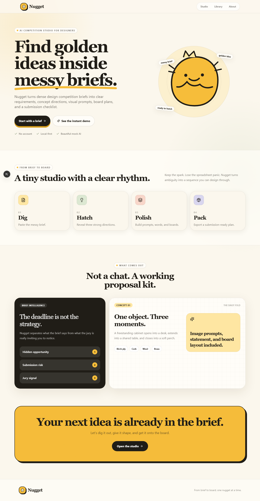
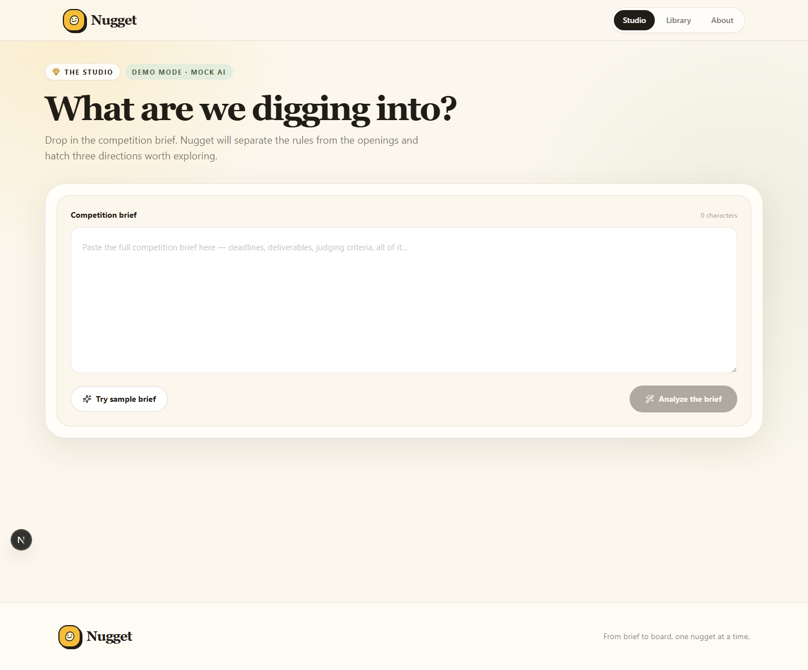
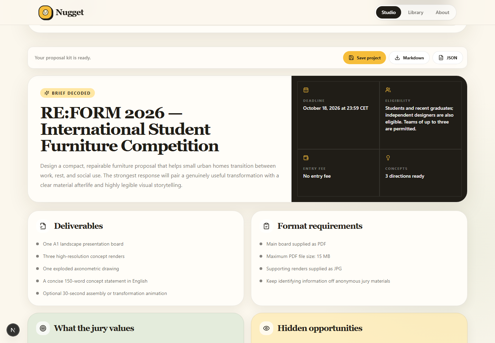
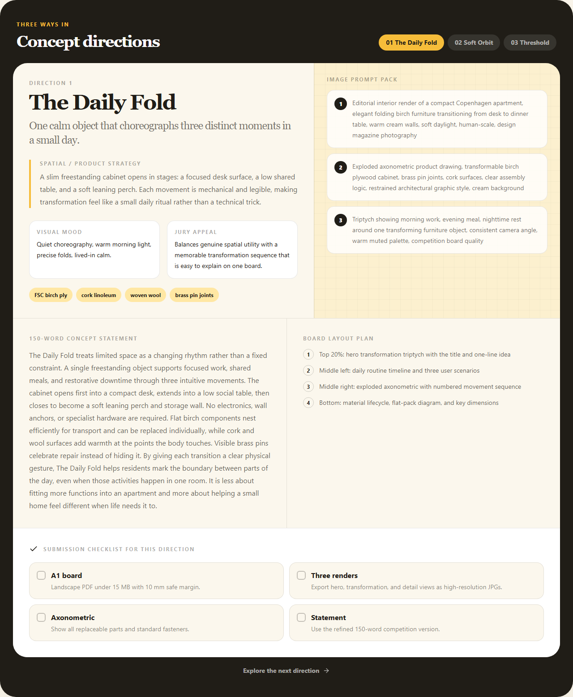
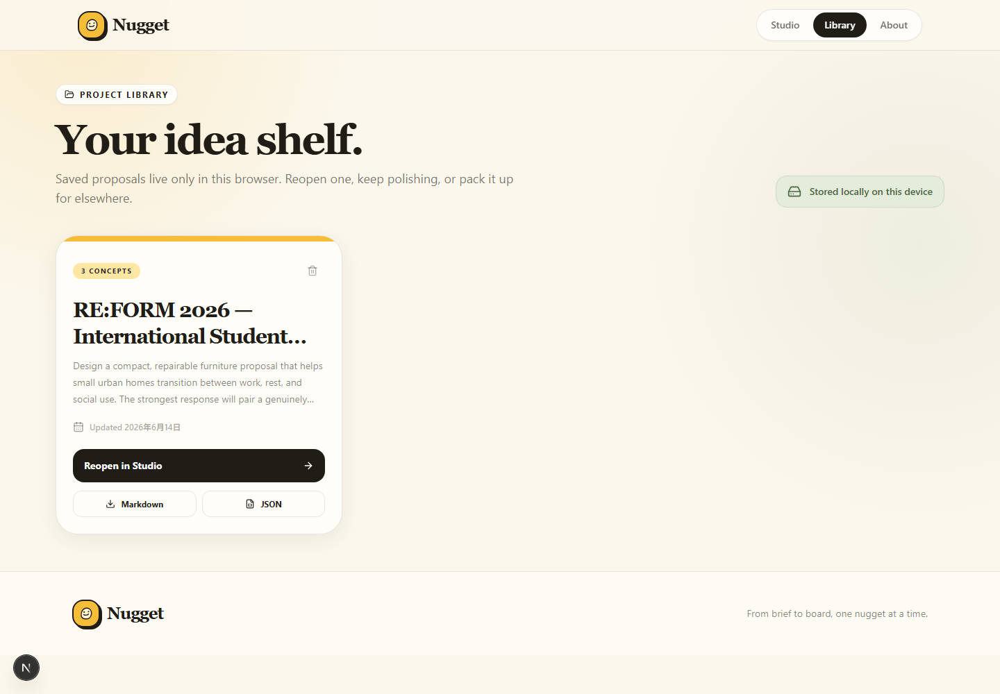
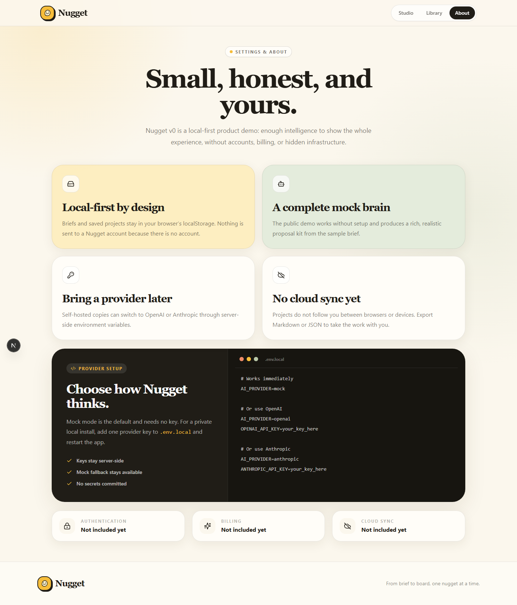
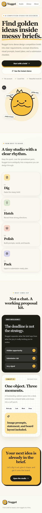
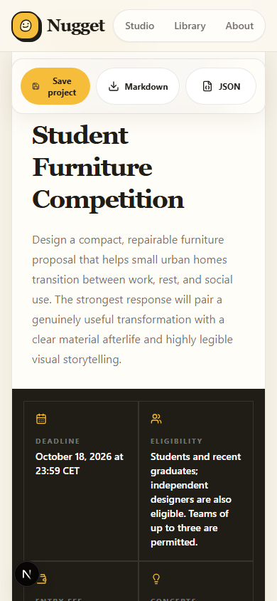

# Nugget Demo Proof

Nugget is a complete local product demo, not a static mockup. The screenshots below show the designed experience, generated analysis, saved-project flow, settings, and responsive layouts.

## Open Locally

- Main app: [http://localhost:3000](http://localhost:3000)
- Instant completed demo: [http://localhost:3000/demo](http://localhost:3000/demo)

Run:

```bash
npm install
npm run dev
```

## Demo Flow

1. Open the app.
2. Click **Start with a brief**.
3. Click **Try sample brief**.
4. Click **Analyze the brief**.
5. Click **Save project**.
6. Open **Library**.
7. Click **Reopen in Studio**.
8. Export **Markdown** or **JSON**.

## Visual Evidence

### 1. Landing page

Shows the Nugget brand, product promise, Dig → Hatch → Polish → Pack workflow, example output, and primary calls to action.



### 2. Empty Studio

Shows the brief input, sample brief action, Demo Mode indicator, and Analyze action before generation.



### 3. Analyzed brief

Shows the generated competition summary, deadline, eligibility, fee, deliverables, format requirements, and export controls.



### 4. Concept directions

Shows the switchable concepts, strategy, material palette, prompt pack, 150-word statement, board plan, and checklist.



### 5. Saved project Library

Proves that a generated project can be saved locally, displayed as a project card, reopened, exported, and deleted.



### 6. Settings and About

Explains local storage, mock mode, optional OpenAI or Anthropic configuration, and current product boundaries.



### 7. Mobile landing page

Shows the complete landing experience adapting to a narrow mobile viewport.



### 8. Mobile Studio result

Shows the generated result and export controls at a 390 px mobile width.



## Regenerate Proof

```bash
npm run demo:screenshots
```

The script starts Nugget automatically when needed, exercises the main flow, and replaces all eight screenshots.
